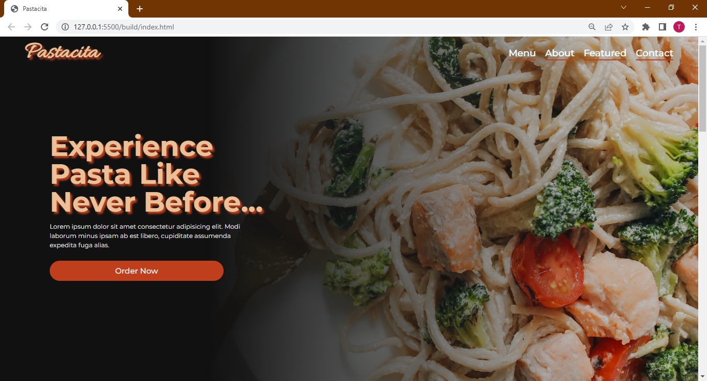

# Pastacita Landing Page

## Description

This is a landing page for an imaginary pasta restaurant called Pastacita. The page features a hero section, a brief description of the restaurant, a section to showcase the restaurant's popular dishes and a footer.

View [Live Site](https://dev-dylann.github.io/pastacita/build)

## Screenshot

## Built With

- Semantic HTML5 Markup
- [Tailwind](https://tailwindcss.com) - CSS Framework
- Javascript
- Fonts from [Google Fonts](https://fonts.google.com)
- [Animate On Scroll](https://https://michalsnik.github.io/aos/) - Animation Library
